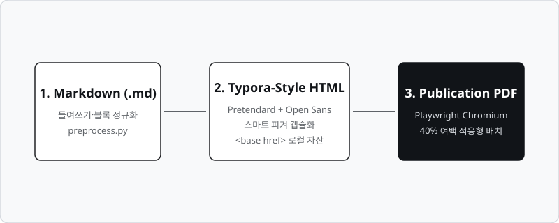

# 의학 및 컴퓨터 공학 통합 연구 보고서

이 문서는 **md2pdf**의 조판 품질과 타이포그래피를 확인하기 위한 샘플 문서입니다. 한글은 *Pretendard*, 영문/숫자는 *Open Sans*, 고정폭 코드는 *D2Coding/Consolas* 글꼴로 단정하게 렌더링됩니다.

## 1. 개요 및 배경

의학 인공지능 연구에서 신호 처리 및 영상 데이터 분석은 정밀한 시각화와 명확한 문서화가 필수적입니다. 본 문서는 마크다운 문서를 출판 품질의 A4 PDF로 변환하는 기술적 사양을 다룹니다.

> "좋은 타이포그래피는 독자가 글의 구조와 핵심을 자연스럽게 파악하도록 돕는 보이지 않는 가이드라인이다."
> — *문서 디자인 가이드라인*

### 1.1 주요 요구 사항

다양한 환경에서 일관된 조판을 보장하기 위해 다음 원칙을 준수합니다:

- **한글 어절 단위 줄바꿈**: `word-break: keep-all` 설정을 통해 단어가 어색하게 분리되지 않습니다.
- **다단계 리스트 계층**:
    - 1단계: 기본 채움원 글머리 기호
        - 2단계: 빈 원 글머리 기호
            - 3단계: 사각형 글머리 기호
- **테이블 페이지 분할 방어**:
    - 머리행(`thead`)은 페이지가 넘어가도 자동 반복됩니다.
    - 행 단위(`tr`) 분할 방지로 표 셀이 중간에서 쪼개지지 않습니다.

---

## 2. 성능 분석 및 벤치마크

다양한 모델의 추론 속도 및 파라미터 규격을 정리한 데이터는 다음과 같습니다.

| 모델 아키텍처 | 파라미터 크기 | 벤치마크 점수 (MMLU) | 지연 시간 (ms) | 비고 |
| :--- | :--- | :--- | :--- | :--- |
| **Model Alpha** | 7B Dense | 68.4% | 14.2 | 경량화 모바일 배포용 |
| **Model Beta** | 14B MoE | 76.9% | 22.8 | 고속 배치 처리 최적화 |
| **Model Gamma** | 70B MoE | 84.2% | 45.1 | 전문 추론 및 논문 요약 |
| **Model Delta** | 120B Dense | 88.7% | 98.6 | 의학 데이터 분석 전용 |

### 2.1 코드 예제

데이터 전처리 및 텐서 변환을 수행하는 파이썬 루틴입니다:

```python
import numpy as np
import torch

def preprocess_signal(raw_waveform: np.ndarray, sample_rate: int = 16000) -> torch.Tensor:
    """생체 신호 데이터를 정규화하고 PyTorch 텐서로 변환합니다."""
    # 0평균, 단위 분산 정규화
    normalized = (raw_waveform - np.mean(raw_waveform)) / (np.std(raw_waveform) + 1e-8)
    tensor = torch.from_numpy(normalized).float()
    return tensor.unsqueeze(0)  # [1, T] 형태 반환
```

## 3. 지능형 이미지 피겨 배치

마크다운의 이미지와 그 직후의 이탤릭 캡션(`*설명*`)은 하나의 피겨(`figure`) 단위로 자동 묶입니다. 페이지 잔여 공간이 40% 이상이면 현재 페이지에 알맞게 축소되어 안착하고, 40% 미만이면 다음 페이지 시작 위치로 깔끔하게 넘어갑니다.



*그림 1: 분산 데이터 처리 파이프라인 및 멀티패스 레이아웃 엔진 구성도*

## 4. 결론

**md2pdf**는 문서의 내용에 집중할 수 있도록 복잡한 CSS 조판과 인쇄 여백, 브라우저 렌더링을 자동으로 조율합니다.

